# Installation of SSH, VScode and markdown

## Creation of a GitHub account

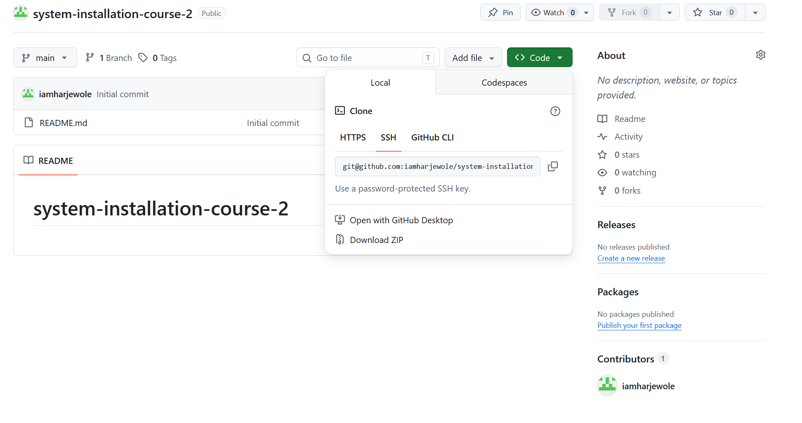

## Installation of Choco package manager

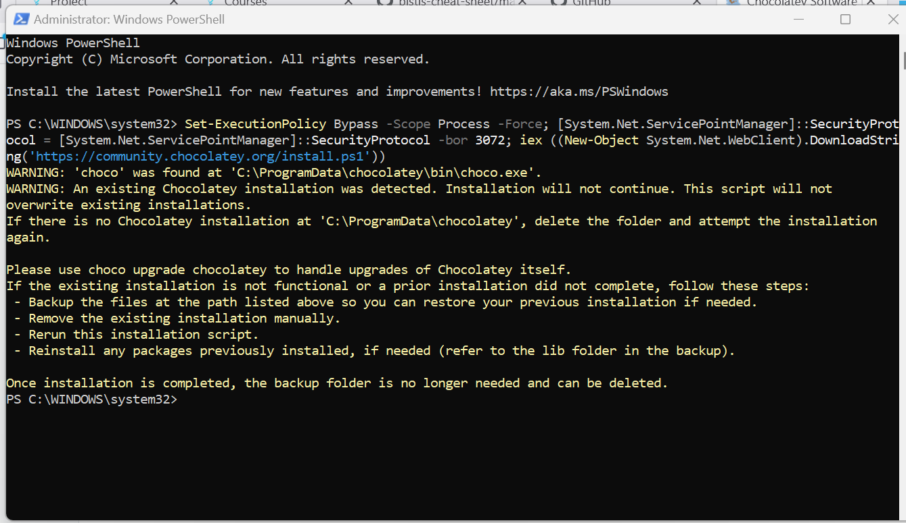

## Installation of Window Terminal

## Installation of git

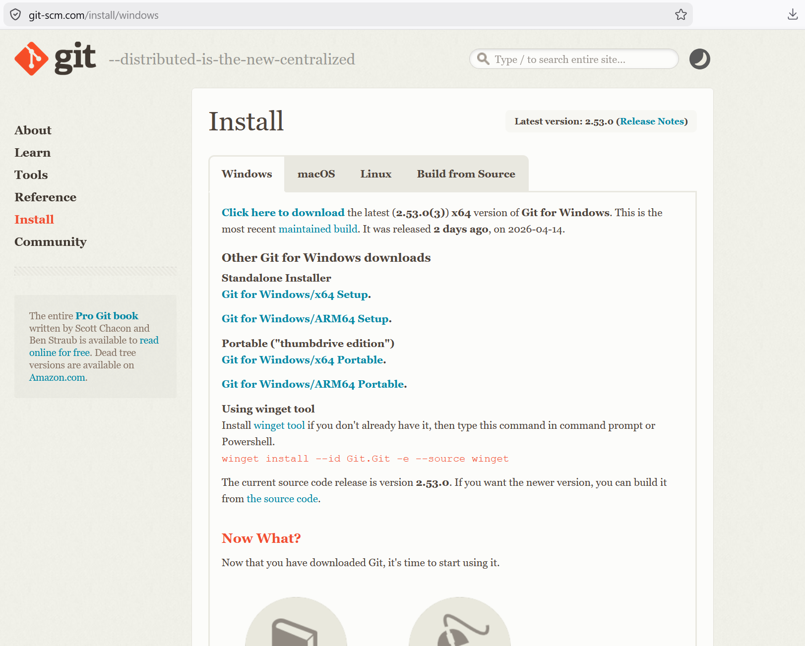

## Git System Run

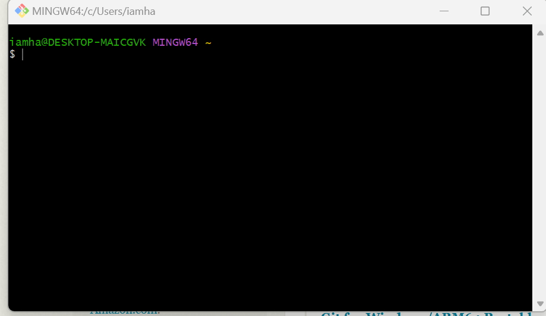

## Installation of VScode

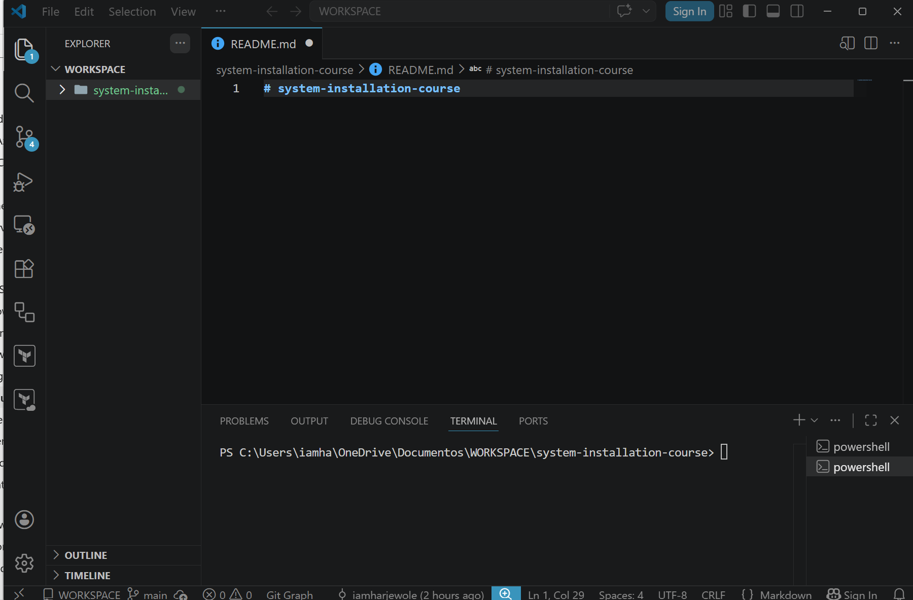

### Create a workspace folder

## Installation of VScode Extensions

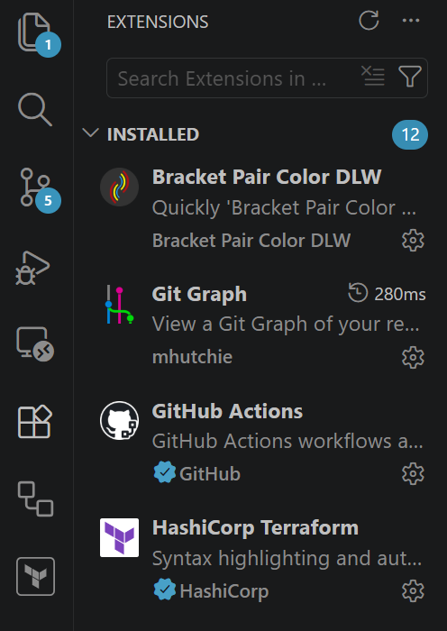

## Installation of SSH

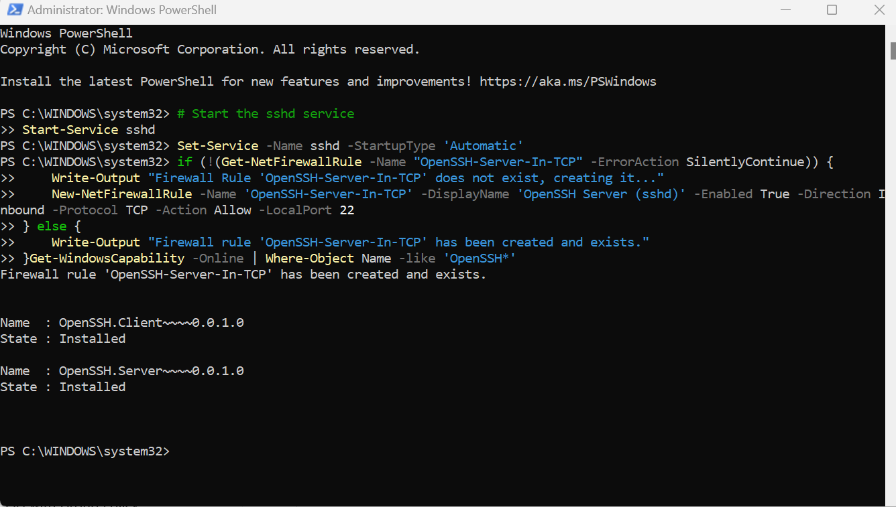

### Setup of SSH Keys

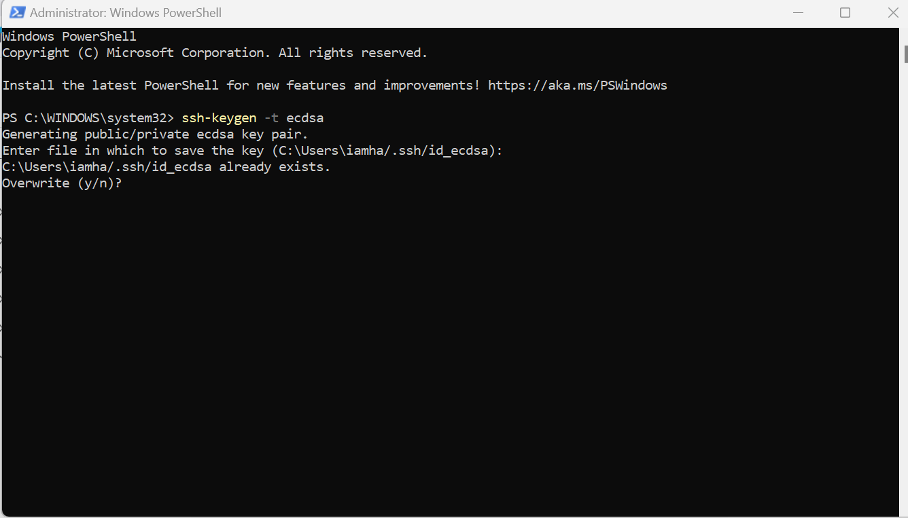

### Setup of SSH Agent

## Copy Public key over to GitHub

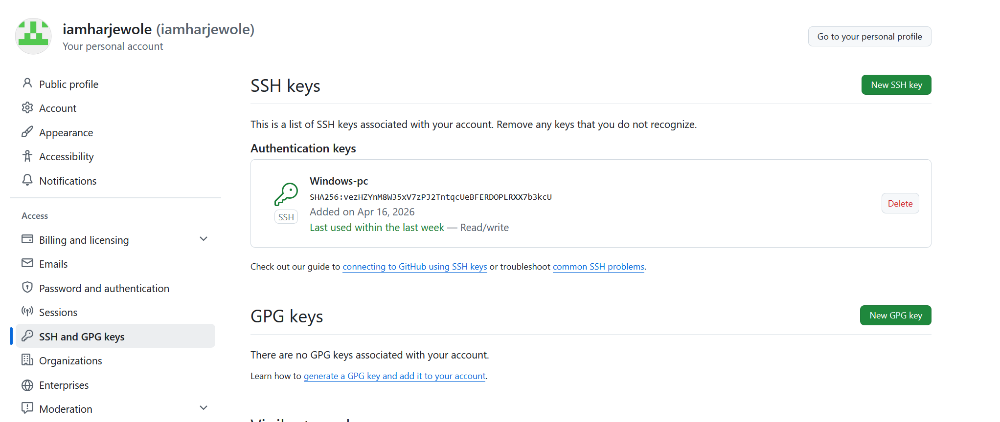

## Simple git Commands

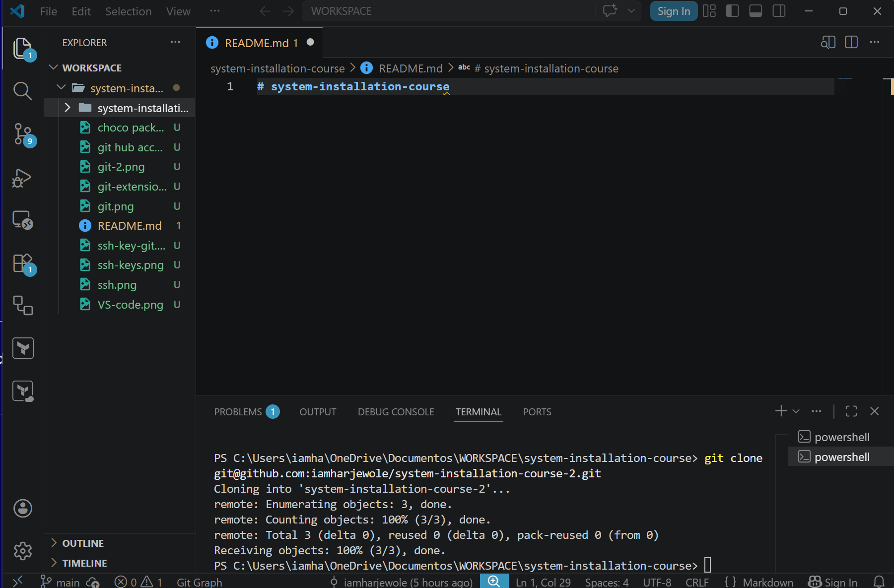

## Create a repository on Github

## Clone the Repository

## Create a markdown document

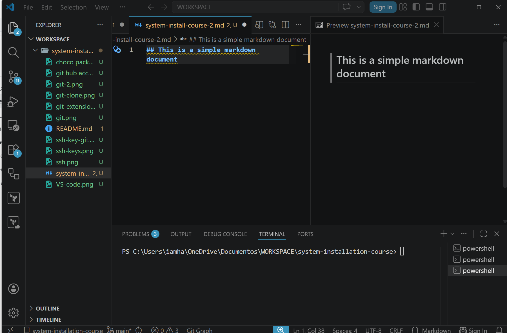

## Push your Changes

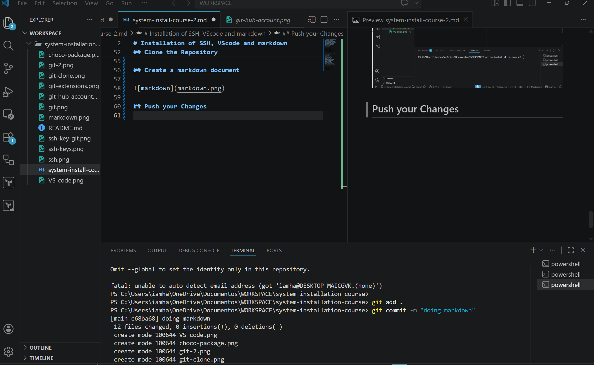
